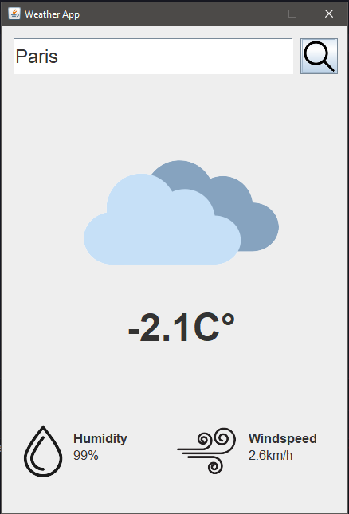

# JAVA Application - Weather App

## Screenshot

### Mobile Screenshot

## Description

This a simple Weather application using <a href="https://open-meteo.com/en/docs/geocoding-api#name=londre" target="_blank">Geocoding API</a> and <a href="https://open-meteo.com/en/docs" target="_blank">Weather forecast API</a>. It has been built with the help of a YouTube Tutorial, link below.

## Links

Original author and tutorial : https://www.youtube.com/watch?v=8ZcEYv2ezWc

## Built with

- Java
- Maven
